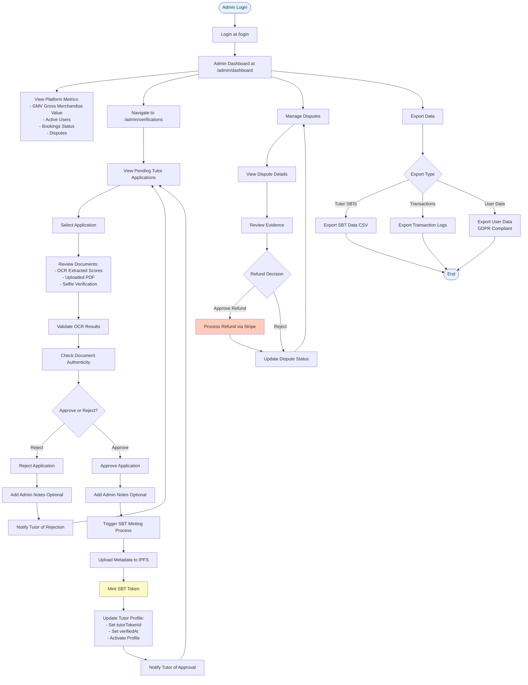
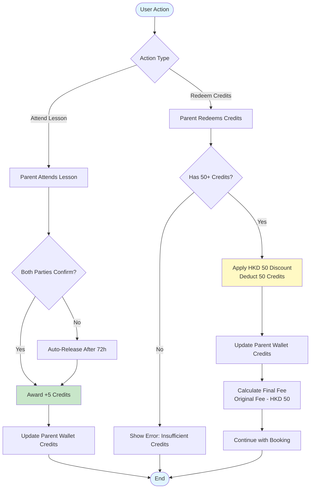

# TUNA Platform - User Flows

## Parent Journey

### 1. Sign Up
- Navigate to `/register`
- Enter email and password
- Select role: "Parent"
- Firebase Auth creates account
- Profile creation form (name, phone, kids' info)

### 2. Browse Tutors
- Navigate to `/search`
- Filter by:
  - Exam type (DSE/IB)
  - Subject (Math, English, Physics, etc.)
  - Price range
  - Rating (minimum)
  - Hours taught (minimum)
- Results show:
  - Tutor name and university
  - SBT token ID (with Etherscan link)
  - Total hours taught
  - Average rating
  - Hourly rate
  - Subject expertise

### 3. View Tutor Profile
- Click on tutor card
- Navigate to `/tutors/[id]`
- View:
  - Full profile
  - Credentials (DSE/IB scores)
  - On-chain reputation (The Graph)
  - Lesson history
  - Reviews and ratings
  - Availability calendar

### 4. Book Lesson
- Click "Book Lesson"
- Navigate to `/book/[tutorId]`
- Select time slot (Cal.com integration)
- Confirm booking details
- Create Stripe payment intent
- Redirect to Stripe Checkout

### 5. Payment
- Pay via FPS or credit card
- Payment processed by Stripe
- Webhook fires to platform
- Payment oracle logs transaction on-chain
- Booking confirmed

### 6. Attend Lesson
- Receive booking confirmation email
- Access lesson via Cal.com link
- Video call (Cal.com/Zoom integration)
- Chat available during lesson

### 7. Rate Tutor
- After lesson completion
- Navigate to `/lessons/[id]/complete`
- Rate 1-5 stars
- Provide feedback (optional)
- Submit rating
- Rating logged on-chain
- Credits earned (+5)

### 8. Redeem Credits
- Navigate to `/wallet`
- View credit balance
- Apply credits to next booking (-HKD 50)

## Tutor Journey

### 1. Sign Up
- Navigate to `/register`
- Enter email and password
- Select role: "Tutor"
- Firebase Auth creates account

### 2. Verify Credentials
- Navigate to `/tutor/verify`
- Upload DSE/IB certificate PDF
- Upload selfie for verification
- Client-side OCR extracts scores
- Submit for review

### 3. Admin Review
- Admin reviews in `/admin/verifications`
- Validates OCR results
- Checks document authenticity
- Approves or rejects

### 4. SBT Minting
- On approval, SBT is minted
- PDF hash stored on IPFS
- SBT metadata includes:
  - Credential hash
  - Exam type (DSE/IB)
  - Extracted scores
- Tutor receives SBT token ID

### 5. Complete Profile
- Navigate to `/dashboard/tutor`
- Add subjects taught
- Set hourly rate
- Add availability
- Write bio
- Upload profile picture

### 6. Receive Bookings
- Email notification for new booking
- View in dashboard
- Accept or decline (if needed)

### 7. Conduct Lessons
- Access lesson via Cal.com link
- Video call with student
- Use chat for communication
- Mark lesson as complete

### 8. Earn Reputation
- Each completed lesson logged on-chain
- Rating affects reputation score
- View stats in dashboard:
  - Total hours taught
  - Total earnings
  - Average rating
  - Lesson count

### 9. View Dashboard
- Navigate to `/dashboard/tutor`
- View:
  - Upcoming lessons
  - Earnings (Stripe)
  - Reputation stats
  - SBT explorer link (Etherscan)
  - Lesson history

## Admin Journey

### 1. Review Verification Queue
- Navigate to `/admin/verifications`
- View pending tutor applications
- See OCR-extracted scores
- Review uploaded documents

### 2. Approve/Reject
- Click "Approve" or "Reject"
- Add admin notes (optional)
- On approval:
  - SBT minted
  - Tutor notified
  - Profile activated

### 3. Monitor Platform
- Navigate to `/admin/dashboard`
- View:
  - GMV (Gross Merchandise Value)
  - Active users (tutors/parents)
  - Bookings (pending/completed)
  - Disputes

### 4. Manage Disputes
- View dispute details
- Review evidence
- Make refund decision
- Update dispute status

### 5. Export Data
- Export tutor SBTs (CSV)
- Export transaction logs
- Export user data (GDPR compliant)

## Business Logic

### Payment Flow
1. Parent pays HKD 500 for lesson
2. Stripe processes payment
3. Platform takes 20% (HKD 100)
4. Tutor receives 80% (HKD 400)
5. Payment logged on-chain
6. Reputation updated

### Credit System
- **Earn**:
  - +5 credits: Attend lesson (automatic after both parties confirm or auto-release)
- **Redeem**:
  - -50 credits: HKD 50 discount on next booking

### Reputation Calculation
- **On-chain**: Total hours, total earnings, average rating, lesson count
- **Weighted**: Recent lessons weighted higher
- **Transparent**: All data queryable via The Graph

### SBT Portability
- SBTs are non-transferable but verifiable
- Tutors can share SBT token ID
- Other platforms can query reputation
- Creates portable reputation system

---

## Visual Flow Charts

The following Mermaid flowcharts provide visual representations of the key user flows and system processes.

### 1. Parent User Flow

```mermaid
flowchart TD
    Start([Parent Visits Platform]) --> Register{Already Registered?}
    Register -->|No| SignUp[Sign Up at /register]
    Register -->|Yes| Login[Login at /login]
    
    SignUp --> CreateAccount[Create Firebase Account]
    CreateAccount --> ProfileForm[Complete Profile Form<br/>Name, Phone, Kids Info]
    ProfileForm --> Dashboard[Parent Dashboard]
    
    Login --> Dashboard
    
    Dashboard --> Browse[Browse Tutors at /search]
    Browse --> Filter[Filter by:<br/>- Exam Type DSE/IB<br/>- Subject<br/>- Price Range<br/>- Rating<br/>- Hours Taught]
    
    Filter --> ViewProfile[View Tutor Profile at /tutors/id]
    ViewProfile --> ViewDetails[View:<br/>- Full Profile<br/>- Credentials<br/>- On-chain Reputation<br/>- Reviews & Ratings<br/>- Availability]
    
    ViewDetails --> BookDecision{Book Lesson?}
    BookDecision -->|No| Browse
    BookDecision -->|Yes| BookPage[Navigate to /book/tutorId]
    
    BookPage --> SelectSlot[Select Time Slot<br/>Cal.com Integration]
    SelectSlot --> ConfirmDetails[Confirm Booking Details]
    ConfirmDetails --> CheckCredits{Use Credits?}
    
    CheckCredits -->|Yes| ApplyCredits[Apply Credits<br/>-50 credits = HKD 50 off]
    CheckCredits -->|No| CreateBooking[Create Booking in Firestore]
    ApplyCredits --> CreateBooking
    
    CreateBooking --> CreatePayment[Create Stripe Payment Intent]
    CreatePayment --> StripeCheckout[Redirect to Stripe Checkout]
    StripeCheckout --> Payment{Payment Method}
    
    Payment -->|FPS| ProcessFPS[Process FPS Payment]
    Payment -->|Credit Card| ProcessCard[Process Card Payment]
    
    ProcessFPS --> PaymentSuccess[Payment Successful]
    ProcessCard --> PaymentSuccess
    
    PaymentSuccess --> Webhook[Stripe Webhook Fires]
    Webhook --> UpdateBooking[Update Booking Status: Confirmed]
    UpdateBooking --> LogOnChain[Log Payment on Blockchain<br/>Payment Oracle Pattern]
    LogOnChain --> SendEmail[Send Confirmation Email]
    
    SendEmail --> AttendLesson[Attend Lesson via Cal.com]
    AttendLesson --> CompleteLesson[Complete Lesson]
    
    CompleteLesson --> RatePage[Navigate to /lessons/id/complete]
    RatePage --> RateTutor[Rate Tutor 1-5 Stars<br/>Provide Feedback]
    RateTutor --> SubmitRating[Submit Rating]
    SubmitRating --> LogRating[Log Rating On-Chain]
    LogRating --> EarnCredits[Earn +5 Credits]
    EarnCredits --> End([End])
    
    style Start fill:#e1f5ff
    style End fill:#e1f5ff
    style PaymentSuccess fill:#c8e6c9
    style LogRating fill:#c8e6c9
```

### 2. Tutor User Flow

```mermaid
flowchart TD
    Start([Tutor Visits Platform]) --> Register{Already Registered?}
    Register -->|No| SignUp[Sign Up at /register<br/>Select Role: Tutor]
    Register -->|Yes| Login[Login at /login]
    
    SignUp --> CreateAccount[Create Firebase Account]
    CreateAccount --> VerifyPage[Navigate to /tutor/verify]
    
    Login --> CheckVerified{Already Verified?}
    CheckVerified -->|No| VerifyPage
    CheckVerified -->|Yes| Dashboard
    
    VerifyPage --> UploadDocs[Upload Documents:<br/>- DSE/IB Certificate PDF<br/>- Selfie for Verification]
    UploadDocs --> OCR[Client-side OCR<br/>Extract Scores]
    OCR --> SubmitReview[Submit for Admin Review]
    SubmitReview --> WaitReview[Wait for Admin Review]
    
    WaitReview --> AdminReview{Admin Decision}
    AdminReview -->|Reject| Rejected[Verification Rejected<br/>Can Re-submit]
    Rejected --> VerifyPage
    
    AdminReview -->|Approve| UploadIPFS[Upload Metadata to IPFS]
    UploadIPFS --> MintSBT[Mint SBT Token<br/>On Polygon Network]
    MintSBT --> UpdateProfile[Update Tutor Profile<br/>Set tutorTokenId]
    UpdateProfile --> CompleteProfile[Complete Profile at /dashboard/tutor]
    
    CompleteProfile --> AddInfo[Add:<br/>- Subjects Taught<br/>- Hourly Rate<br/>- Availability<br/>- Bio<br/>- Profile Picture]
    AddInfo --> Dashboard[Tutor Dashboard]
    
    Dashboard --> ViewStats[View:<br/>- Upcoming Lessons<br/>- Earnings<br/>- Reputation Stats<br/>- SBT Explorer Link<br/>- Lesson History]
    
    Dashboard --> ReceiveBooking[Receive Booking Notification]
    ReceiveBooking --> AcceptBooking{Accept Booking?}
    AcceptBooking -->|Decline| Dashboard
    AcceptBooking -->|Accept| ConductLesson[Conduct Lesson via Cal.com]
    
    ConductLesson --> VideoCall[Video Call with Student]
    VideoCall --> Chat[Use Chat for Communication]
    Chat --> MarkComplete[Mark Lesson as Complete]
    
    MarkComplete --> PaymentProcessed[Payment Processed by Stripe]
    PaymentProcessed --> LogOnChain[Lesson Logged On-Chain]
    LogOnChain --> UpdateReputation[Reputation Updated:<br/>- Total Hours<br/>- Total Earnings<br/>- Average Rating<br/>- Lesson Count]
    
    UpdateReputation --> ReceiveRating[Receive Rating from Parent]
    ReceiveRating --> UpdateReputation
    UpdateReputation --> Dashboard
    
    style Start fill:#e1f5ff
    style MintSBT fill:#fff9c4
    style LogOnChain fill:#c8e6c9
    style UpdateReputation fill:#c8e6c9
```

### 3. Admin User Flow

### 4. Payment Flow with Escrow (Detailed)

```mermaid
flowchart TD
    Start([Parent Initiates Booking]) --> CreateBooking[Create Booking in Firestore<br/>Set confirmationDeadline: 72h from lesson end]
    CreateBooking --> CheckCredits{Use Credits?}
    
    CheckCredits -->|Yes| CalculateDiscount[Calculate Credit Discount<br/>-50 credits = HKD 50 off]
    CheckCredits -->|No| SetFinalFee[Set Final Fee = Original Fee]
    CalculateDiscount --> SetFinalFee
    
    SetFinalFee --> CheckStripe{Has Stripe Account?}
    CheckStripe -->|No| Error[Error: Tutor Not Set Up]
    CheckStripe -->|Yes| CreatePaymentIntent[Create Stripe Payment Intent<br/>capture_method: manual ESCROW]
    
    CreatePaymentIntent --> PaymentIntentDetails[Payment Intent Details:<br/>- Amount: Final Fee<br/>- Currency: HKD<br/>- Capture Method: Manual<br/>- Application Fee: 20%<br/>- Transfer to Tutor: 80%<br/>- Metadata: bookingId, tutorTokenId]
    
    PaymentIntentDetails --> UpdateBooking[Update Booking:<br/>- paymentIntentId<br/>- status: payment_held<br/>- paymentStatus: requires_capture]
    UpdateBooking --> ReturnClientSecret[Return clientSecret to Client]
    
    ReturnClientSecret --> StripeCheckout[Redirect to Stripe Checkout]
    StripeCheckout --> PaymentMethod{Payment Method}
    
    PaymentMethod -->|FPS| ProcessFPS[Process FPS Payment]
    PaymentMethod -->|Credit Card| ProcessCard[Process Card Payment]
    
    ProcessFPS --> PaymentResult{Payment Result}
    ProcessCard --> PaymentResult
    
    PaymentResult -->|Failed| PaymentFailed[Payment Failed]
    PaymentFailed --> UpdateBookingFailed[Update Booking Status: cancelled]
    UpdateBookingFailed --> NotifyUser[Notify User of Failure]
    NotifyUser --> End([End])
    
    PaymentResult -->|Success| PaymentAuthorized[Payment Authorized HELD IN ESCROW]
    PaymentAuthorized --> StripeWebhook[Stripe Webhook Event:<br/>payment_intent.succeeded]
    
    StripeWebhook --> VerifyWebhook[Verify Webhook Signature]
    VerifyWebhook --> GetBooking[Get Booking from Firestore]
    GetBooking --> CheckProcessed{Already Processed?}
    
    CheckProcessed -->|Yes| Skip[Skip Processing]
    CheckProcessed -->|No| GenerateHash[Generate Payment Hash<br/>Keccak256 of payment details]
    
    GenerateHash --> UpdateBookingStatus[Update Booking:<br/>- status: payment_held<br/>- paymentProcessed: true<br/>- paymentHash: hash<br/>- paidAt: timestamp<br/>NOT CAPTURED YET]
    
    UpdateBookingStatus --> WaitConfirmation[Wait for Dual Confirmation<br/>or Auto-Release After 72h]
    WaitConfirmation --> BothConfirm{Both Parties Confirm?}
    
    BothConfirm -->|Yes| CapturePayment[Capture Payment via Stripe]
    BothConfirm -->|No| CheckTimeout{72h Passed?}
    
    CheckTimeout -->|Yes| AutoCapture[Auto-Capture Payment<br/>Regardless of Disputes]
    CheckTimeout -->|No| WaitConfirmation
    
    CapturePayment --> PaymentCaptured[Payment Captured<br/>Funds Released to Tutor]
    AutoCapture --> PaymentCaptured
    
    PaymentCaptured --> LogOnChain[Log Lesson On-Chain<br/>Update Reputation]
    LogOnChain --> AwardCredits[Award +5 Credits to Parent]
    AwardCredits --> UpdateBookingComplete[Update Booking:<br/>- status: completed<br/>- paymentCaptured: true]
    UpdateBookingComplete --> SendEmail[Send Confirmation Email]
    SendEmail --> End
    
    style Start fill:#e1f5ff
    style End fill:#e1f5ff
    style PaymentAuthorized fill:#fff9c4
    style PaymentCaptured fill:#c8e6c9
    style PaymentFailed fill:#ffcdd2
    style AutoCapture fill:#fff9c4
```

### 5. Verification & SBT Minting Flow

```mermaid
flowchart TD
    Start([Tutor Submits Verification]) --> UploadFiles[Upload Files:<br/>- Certificate PDF<br/>- Selfie Image]
    
    UploadFiles --> UploadStorage[Upload to Firebase Storage]
    UploadStorage --> GetURLs[Get Download URLs]
    
    GetURLs --> OCRProcess[Client-side OCR Processing<br/>Tesseract.js]
    OCRProcess --> ExtractScores[Extract Exam Scores from PDF]
    
    ExtractScores --> UploadIPFS1[Upload PDF to IPFS Pinata]
    UploadIPFS1 --> GetIPFSHash[Get IPFS Hash]
    
    GetIPFSHash --> CreateVerification[Create Verification Document in Firestore]
    CreateVerification --> SetStatus[Set Status: pending]
    SetStatus --> NotifyAdmin[Notify Admin]
    
    NotifyAdmin --> AdminReview[Admin Reviews at /admin/verifications]
    AdminReview --> ViewDocs[View:<br/>- OCR Extracted Scores<br/>- PDF Document<br/>- Selfie]
    
    ViewDocs --> Validate[Validate:<br/>- OCR Accuracy<br/>- Document Authenticity<br/>- Score Validity]
    
    Validate --> Decision{Approve or Reject?}
    
    Decision -->|Reject| Reject[Reject Verification]
    Reject --> UpdateStatusReject[Update Status: rejected]
    UpdateStatusReject --> NotifyTutorReject[Notify Tutor]
    NotifyTutorReject --> End([End])
    
    Decision -->|Approve| Approve[Approve Verification]
    Approve --> PrepareMetadata[Prepare SBT Metadata:<br/>- tutorId<br/>- examType DSE/IB<br/>- ipfsHash<br/>- verifiedAt<br/>- verifiedBy]
    
    PrepareMetadata --> UploadIPFS2[Upload Metadata to IPFS]
    UploadIPFS2 --> GetCredHash[Get Credential Hash]
    
    GetCredHash --> GetWallet[Get Tutor Wallet Address]
    GetWallet --> MintSBT[Mint SBT via Contract<br/>mintTutor function]
    
    MintSBT --> ContractCall[Contract Execution:<br/>- Generate tokenId<br/>- Safe Mint to Tutor<br/>- Store credHash<br/>- Store examType<br/>- Emit Events]
    
    ContractCall --> GetTokenId[Get Token ID from Contract]
    GetTokenId --> UpdateVerification[Update Verification Document:<br/>- status: approved<br/>- tutorTokenId<br/>- txHash<br/>- approvedAt]
    
    UpdateVerification --> UpdateTutorProfile[Update Tutor Profile:<br/>- tutorTokenId<br/>- verifiedAt<br/>- verified: true]
    
    UpdateTutorProfile --> NotifyTutor[Notify Tutor of Approval]
    NotifyTutor --> IndexSubgraph[The Graph Indexes Event]
    IndexSubgraph --> QueryReputation[Reputation Queryable via The Graph]
    
    QueryReputation --> End
    
    style Start fill:#e1f5ff
    style End fill:#e1f5ff
    style MintSBT fill:#fff9c4
    style ContractCall fill:#fff9c4
    style QueryReputation fill:#c8e6c9
```

### 6. Credit System Flow

### 7. Lesson Completion & Rating Flow with Escrow

```mermaid
flowchart TD
    Start([Lesson Scheduled]) --> LessonTime[Lesson Time Arrives]
    LessonTime --> AccessLesson[Access Lesson via Cal.com Link]
    
    AccessLesson --> VideoCall[Video Call Session]
    VideoCall --> Chat[Chat Available During Lesson]
    
    Chat --> LessonEnd{Lesson Complete?}
    LessonEnd -->|No| VideoCall
    LessonEnd -->|Yes| TutorConfirm[Tutor Confirms Completion]
    
    TutorConfirm --> ParentConfirm[Parent Confirms Completion]
    
    ParentConfirm --> BothConfirmed{Both Confirmed?}
    BothConfirmed -->|Yes| CapturePayment[Capture Payment from Escrow<br/>Release Funds to Tutor]
    BothConfirmed -->|No| WaitConfirmation[Wait for Other Party<br/>or Auto-Release After 72h]
    
    WaitConfirmation --> CheckTimeout{72h Passed?}
    CheckTimeout -->|Yes| AutoCapture[Auto-Capture Payment<br/>Regardless of Disputes]
    CheckTimeout -->|No| BothConfirmed
    
    CapturePayment --> LogLesson[Log Lesson On-Chain<br/>via logLesson function]
    AutoCapture --> LogLesson
    
    LogLesson --> ContractUpdate[Contract Updates:<br/>- Add to tutorLogs array<br/>- Prevent duplicate via paymentHash<br/>- Emit LessonCompleted event]
    
    ContractUpdate --> AwardCredits[Award +5 Credits to Parent]
    AwardCredits --> UpdateBookingStatus[Update Booking Status: completed]
    UpdateBookingStatus --> NotifyParent[Notify Parent to Rate]
    
    NotifyParent --> RatePage[Parent Navigates to<br/>/lessons/id/complete]
    RatePage --> DisplayForm[Display Rating Form]
    DisplayForm --> RateInput[Parent Inputs:<br/>- Rating 1-5 Stars<br/>- Optional Feedback<br/>Can Rate Negatively if Disputed]
    
    RateInput --> SubmitRating[Submit Rating]
    SubmitRating --> UpdateRating[Update Lesson Rating On-Chain<br/>if not already logged]
    
    UpdateRating --> RecalculateRep[Recalculate Tutor Reputation:<br/>- Average Rating<br/>- Total Lessons<br/>- Weighted Recent Lessons]
    
    RecalculateRep --> UpdateTutorStats[Update Tutor Dashboard Stats]
    UpdateTutorStats --> End([End])
    
    style Start fill:#e1f5ff
    style End fill:#e1f5ff
    style CapturePayment fill:#c8e6c9
    style AutoCapture fill:#fff9c4
    style LogLesson fill:#fff9c4
    style ContractUpdate fill:#fff9c4
    style AwardCredits fill:#c8e6c9
```

---

## Flow Summary

### Parent Journey
1. **Sign Up** → **Browse Tutors** → **View Profile** → **Book Lesson** → **Pay** → **Attend** → **Rate** → **Earn Credits**

### Tutor Journey
1. **Sign Up** → **Verify Credentials** → **Get SBT** → **Complete Profile** → **Receive Bookings** → **Conduct Lessons** → **Earn Reputation**

### Admin Journey
1. **Review Verifications** → **Approve/Reject** → **Monitor Platform** → **Manage Disputes** → **Export Data**

### Technical Flows
- **Payment**: Stripe Escrow → Dual Confirmation → Capture → On-chain Logging (Payment Oracle Pattern)
- **Verification**: OCR → IPFS → SBT Minting → The Graph Indexing
- **Credits**: Earn (Attend Lesson) → Redeem (Booking Discount)
- **Disputes**: Track Only → Payment Always Releases → Enable Negative Ratings

